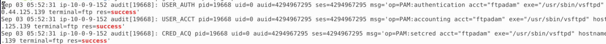

# Lab: Linux System Hunt

## Scenario 

A potential compromise on a Linux developer server after suspicious Slack activity and unusual network connections were reported

## Summary
The threat actor utilized FTP to gain initial access to the server
## Triage
- Host, timeframe, initial evidence (e.g., "auth.log shows RDP-like behavior" — adapt)

## Commands Run
- journalctl | grep -i "ftp" | grep -i "success" 
- journalctl | grep -i /tmp

## Findings (timeline)
- Timestamp — Event — Evidence — Artifact (file path, PID, log line)
- Access via FTP on Sept 3rd at 05:52:31

- User dropped a shell script via wget command 

## Persistence / Root Cause
- What persisted (cron, systemd, user account, web shell), how it worked

## Mitigation / Recommendations
- Steps to remove, patch, block IPs, rotate creds

## Artifacts
- Links to forensic files (sanitized) and PCAP

## MITRE ATT&CK mapping
- T1133 (initial access via remote services)

