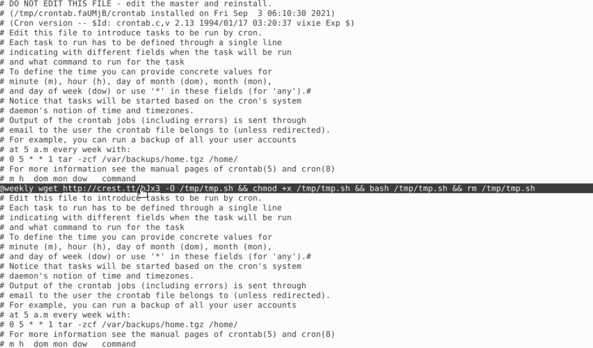
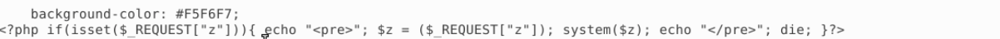

# Lab: Linux System Hunt

## Scenario 

A potential compromise on a Linux developer server after suspicious Slack activity and unusual network connections were reported

## Summary
The threat actor utilized FTP to gain initial access to the server

## Commands Run
- journalctl | grep -i "ftp" | grep -i "success"  to check for successful FTP authentications
- journalctl | grep -i /tmp to check for changes to the /tmp directory
- find / -newermt "3 Sept 2021 06:00:03" ! -newermt "3 Sept 2021 06:01:47" 2>/dev/null to find modified files between within the timefram
- journalctl | grep ftpadam | grep "110\.44\.125\.139" to search for all activities belonging to ftpadam (account logged into by the threat actor) and determine their activity

## Findings (timeline)

### Initial Access
- Access via FTP on Sept 3rd at 05:52:31

### Persistence
- A shell script was dropped to the tmp directory by root via wget on Sept 05 at 00:00:01 and made it executable 

- A weekly cron job that downloads a remote script to the tmp directory and attempts to execute it as root

### Remote code execution via web shell
A PHP file was. The snippet in the screenshot below checks whether an HTTP parameter named z was provided (\$_REQUEST["z"]). If so, it prints a "pre" tag, assigns the parameter to \$z, and calls system(\$z). system() executes the string as a shell command on the server and returns output. *die* ends script execution after running the command. An attacker can send `http://victim/shell.php?z=whoami` (or other commands) and have the server run arbitrary shell commands as the web server user

The last activity performed by the user on Sept 3rd 09:25:25

## Mitigation
- Steps to remove, patch, block IPs, rotate creds

## MITRE ATT&CK Mapping
- T1133 (initial access via remote services)
- T1053.003 (Persistence via Scheduled Task/Job)

