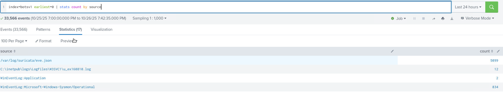
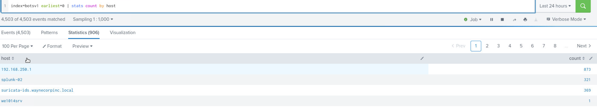
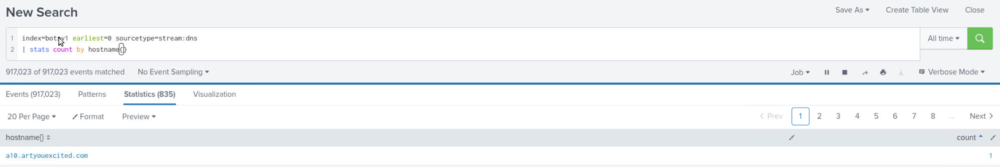
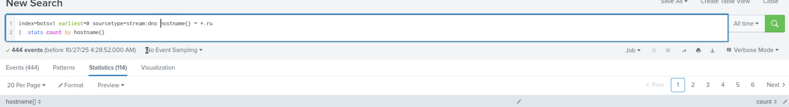
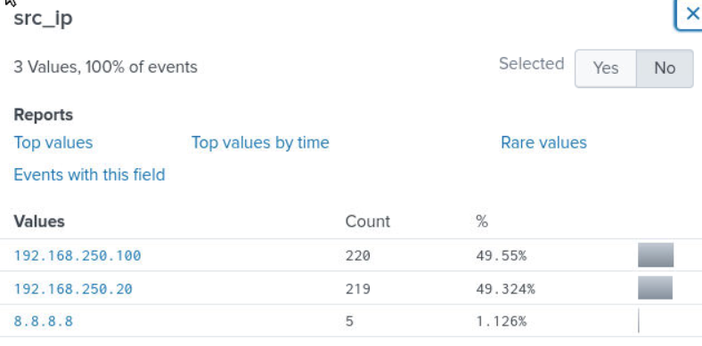
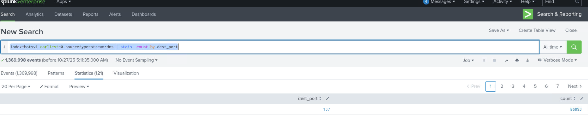
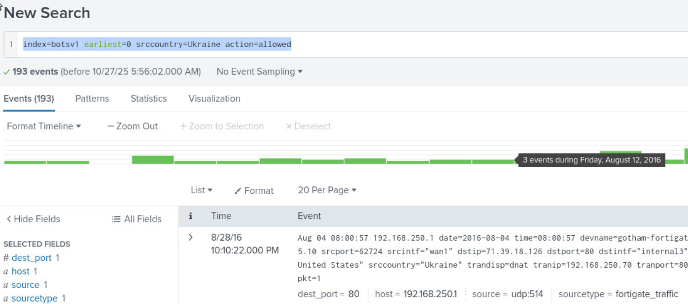

# Investigation Scenario
You are stepping into an immature SOC environment as the sole analyst on duty, responsible for assessing the organization’s security posture. Your goal is to familiarize yourself with the available data sources, understand the logging environment, and begin identifying potential threats or anomalies using Splunk. Since the SOC lacks mature processes and automation, you’ll rely heavily on manual investigation and analytical reasoning to uncover suspicious activity across large datasets.

1) Query: `index="botsv1" earliest=0 | stats count by source`

This query shows that **Suricata** is the IDS in use within the environment, and **Sysmon** is the advanced logging driver for Windows event logs.
 

2) Query: `index="botsv1" earliest=0 | stats count by host`
The host **192.168.250.1** generated the highest number of events. Server naming follows a **wexxxxsrv** convention.
 

3) Query: `index=botsv1 earliest=0 sourcetype=stream:dns | stats count by hostname{}` 

Searching for the DNS logs, counting the numbers of hosts, and sorting in an ascending manner yields a domain that has been communicated with once: **`a10.artyouexcited.com`**
  

4) Query: `index=botsv1 earliest=0 sourcetype=stream:dns hostname= *.ru|  stats count by hostname{}`

The query identified 114 unique .ru domains contacted within the dataset.

  

5) Query: `index=botsv1 earliest=0 sourcetype=stream:dns hostname{} = *.ru`

Filtering for connections to .ru domains shows two internal hosts responsible for these: **192.168.250.100** and **192.168.250.20**.

 

6) Query: `index=botsv1 earliest=0 sourcetype=stream:dns | stats  count by dest_port`

This query shows **121** unique destination ports used in DNS-related traffic (many non-DNS ports). The highest usage is port **137** (**NetBIOS**) with **86,893** events.

7) Query: `index=botsv1 earliest=0 srccountry=Ukraine action=allowed`

Looking at allowed inbound connections from Ukraine in the FortiGate logs, there were **193** connections, all targeting destination port **80** (**HTTP**).

### Summary
This initial investigation provided visibility into the network’s DNS activity and potential outbound communications to suspicious domains, including .ru TLDs. Further analysis should focus on the systems 192.168.250.100 and 192.168.250.20, as they exhibit possible indicators of compromise through their external connections.

### MITRE Mapping
**MITRE ATT&CK:** T1071.004 – Application Layer Protocol: DNS