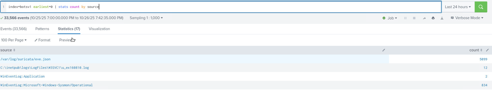
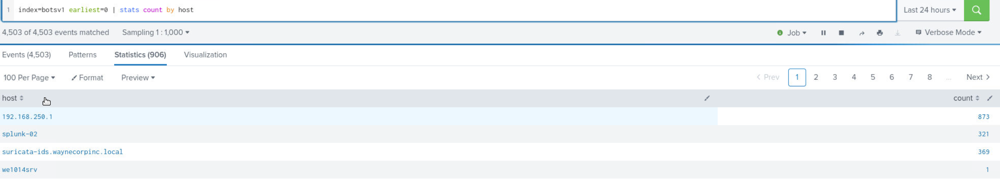

# Investigation Scenario
You are stepping into an immature SOC environment as the sole analyst on duty, responsible for assessing the organization’s security posture. Your goal is to familiarize yourself with the available data sources, understand the logging environment, and begin identifying potential threats or anomalies using Splunk. Since the SOC lacks mature processes and automation, you’ll rely heavily on manual investigation and analytical reasoning to uncover suspicious activity across large datasets.

Query: `index="botsv1" earliest=0 | stats count by source`

**Suricata** is the IDS being used within the environment

**sysmon** is the advanced logging driver for windows event logs
 

Query: `index="botsv1" earliest=0 | stats count by host`
Host, **192.168.250.1**, has the highest count of events

wexxxxsrv is the naming convention for the servers
 

