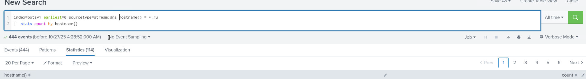

# Investigation Scenario
You are stepping into an immature SOC environment as the sole analyst on duty, responsible for assessing the organization’s security posture. Your goal is to familiarize yourself with the available data sources, understand the logging environment, and begin identifying potential threats or anomalies using Splunk. Since the SOC lacks mature processes and automation, you’ll rely heavily on manual investigation and analytical reasoning to uncover suspicious activity across large datasets.

1) Query: `index="botsv1" earliest=0 | stats count by source`

**Suricata** is the IDS being used within the environment

**sysmon** is the advanced logging driver for windows event logs
 

2) Query: `index="botsv1" earliest=0 | stats count by host`

Host, **192.168.250.1**, has the highest count of events

wexxxxsrv is the naming convention for the servers
 

3) Query: `index=botsv1 earliest=0 sourcetype=stream:dns | stats count by hostname{}` 

Searching for the DNS logs, counting the numbers of hosts, and sorting in an ascending manner yields a domain that has been communicated with once: **`a10.artyouexcited.com`**
  

4) Query: `index=botsv1 earliest=0 sourcetype=stream:dns hostname{} = *.ru|  stats count by hostname{}`

Searching for the number of Russian domains contacted shows **114** in the statistics tab

  

5) Query: `index=botsv1 earliest=0 sourcetype=stream:dns hostname{} = *.ru`

searching for the IPs that made the connections to the Russian domains shows 2 private IPs: **192.168.250.100**, **192.168.250.20**

 