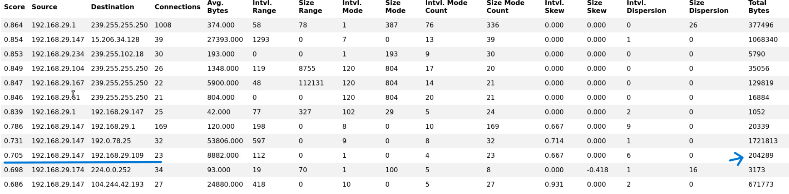
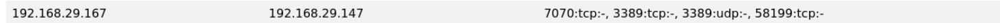
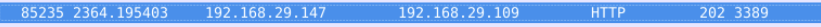

# RITA Lab: Detecting Beaconing and Tunneling via RITA and Wireshark

A walkthrough for using **RITA (Real Intelligence Threat Analytics)** and **Wireshark** to detect **beaconing** and **tunneling** behavior from network traffic.

## Summary (TL;DR)
I converted the supplied PCAP into Zeek logs, imported them into RITA, and analyzed beaconing, long connections, and DNS activity

- 192.168.29.109 was the suspected internal C2 host.

- Hosts observed communicating with that cluster of suspicious hosts:

  - 192.168.29.147 — identified as communicating with the suspected C2.

  - 192.168.29.67 — made long-duration connections to 192.168.29.147 on ports 7070/TCP, 3389/TCP, 3389/UDP, and 58199/TCP.

- A high-entropy domain was observed in RITA's DNS tab:
`iuqssfsodp9ifjaposdfjhgosurijfaewrwergwea.com`

- HTTP traffic was observed as the application protocol, but on port 3389 (HTTP-over-nonstandard-port / port masquerading).
 

- HTTP requests from the client used the WinHTTP user-agent:
`Mozilla/4.0 (compatible; Win32; WinHttp.WinHttpRequest.5)`; typical of automated C2 clients.

## Recommendations

- **Containment**
  - Network contain the infected hosts; ; 192.168.29.109, 192.168.29.147, 192.168.29.67
- **Eradication & Recovery**
  - Reimage the aforementioned infected hosts
- **Hunting & Detection**
  - Add detections: HTTP traffic on non-standard ports, WinHTTP User-Agent patterns, many unique DNS subdomains per domain, and long-duration TCP sessions on unusual ports.
- **Network Controls**
  - Deny http traffic on uncommon ports unless explicity requried
  - Block the aforementioned suspicious domain

| ATT&CK ID | Technique (short)                         | Evidence (from lab)                                                                                          |
| --------- | ----------------------------------------- | ------------------------------------------------------------------------------------------------------------ |
| T1071.001 | Application Layer Protocol: HTTP          | HTTP observed (WinHTTP UA) used as C2; HTTP over port **3389** (port masquerading).                          |
| T1095     | Non-Application Layer Protocol: Tunneling | High-entropy DNS domain → possible DNS tunneling.                 |

