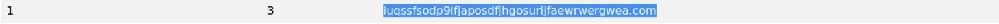

# RITA Lab: Detecting Beaconing and Tunneling via RITA and Wireshark

A walkthrough for using **RITA (Real Intelligence Threat Analytics)** and **Wireshark** to detect **beaconing** and **tunneling** behavior from network traffic.

## Summary (TL;DR)
I converted the supplied PCAP into Zeek logs, imported them into RITA, and analyzed beaconing, long connections, and DNS activity

- 192.168.29.109 was the suspected internal C2 host (lab prompt).

- Hosts observed communicating with that cluster of suspicious hosts:

- 192.168.29.147 — identified as communicating with the suspected C2.

- 192.168.29.150 — made long-duration connections to 192.168.29.147 on ports 7070/TCP, 3389/TCP, 3389/UDP, and 58199/TCP.

- A high-entropy domain was observed in DNS:
iuqssfsodp9ifjaposdfjhgosurijfaewrwergwea.com — suspicious for DGA or DNS tunneling.

- HTTP traffic was observed as the application protocol, but on port 3389 (HTTP-over-nonstandard-port / port masquerading).

- HTTP requests from the client used the WinHTTP user-agent:
Mozilla/4.0 (compatible; Win32; WinHttp.WinHttpRequest.5); typical of automated C2 clients.

- You generated rita import html-report, produced index.html, and captured screenshots (added to your writeup).

  

 